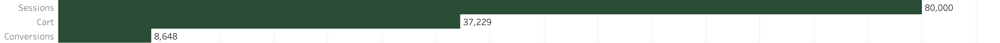
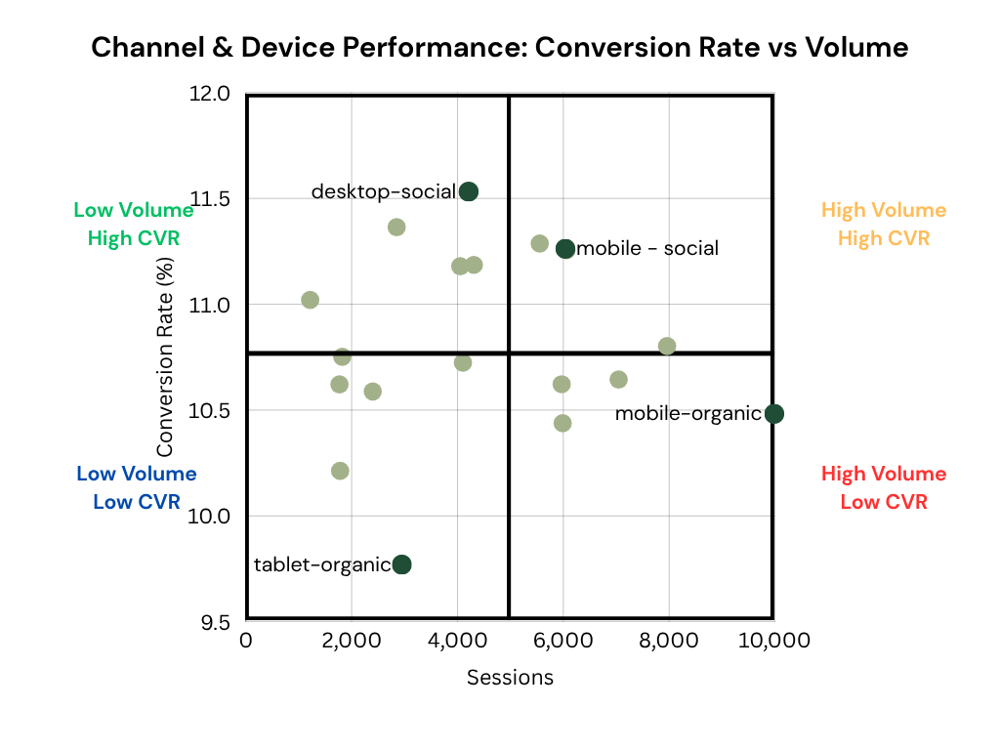
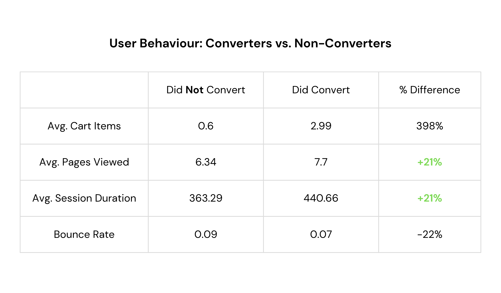
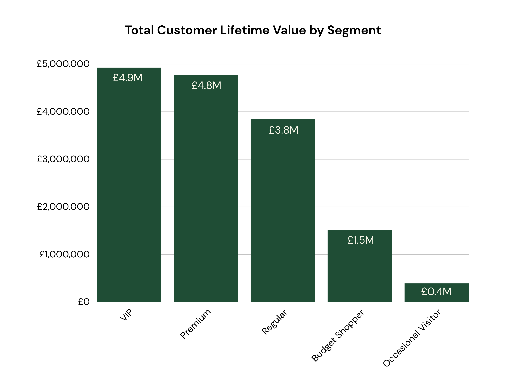
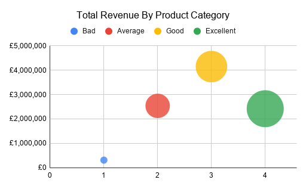
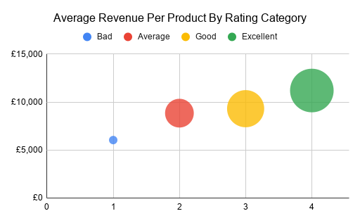

# E-commerce Conversion & Customer Analysis

## Overview
This project analyses user behaviour, conversion performance, and customer value for an e-commerce platform. 

The goal is to identify key drivers of conversion and opportunities to improve revenue using SQL-based analysis.

## Data Source
The dataset was sourced from Kaggle (E-commerce Customer Behaviour Dataset) and analysed using Google BigQuery.

It consists of multiple relational tables, including sessions, customers, transactions, products, and reviews.

## Key Questions
1. Where do users drop off in the conversion funnel?
2. Which channels and devices perform best?
3. What behaviours influence conversion?
4. Which customers are the most valuable?
5. Do product ratings and reviews impact sales?

## Key Insights

- A significant drop-off occurs between cart and conversion, indicating friction at checkout.
- Mobile organic traffic drives the highest volume but underperforms in conversion, representing the biggest optimisation opportunity.
- Cart activity is the strongest behavioural indicator of purchase intent.
- Customers who use the app and opt into email generate the highest lifetime value.
- Higher-rated products generate greater revenue per product, with potential for revenue uplift through improved ratings.

## SQL Queries

- [Funnel Analysis](sql/01_funnel_analysis.sql)
- [Channel & Device Performance](sql/02_channel_device.sql)
- [Behaviour Analysis](sql/03_behaviour.sql)
- [Customer Value Analysis](sql/04_customer_value.sql)
- [Product Analysis](sql/05_product_analysis.sql)

## 📊 Visual Analysis

#### 1. Funnel Overview

  

#### 2. Scatter Plot Analysis

  

#### 3. User Behaviour Summary

  

#### 4. Customer Lifetime Value (CLTV)

  

#### 5. Do Product Ratings and Reviews Impact Sales?

  
  

